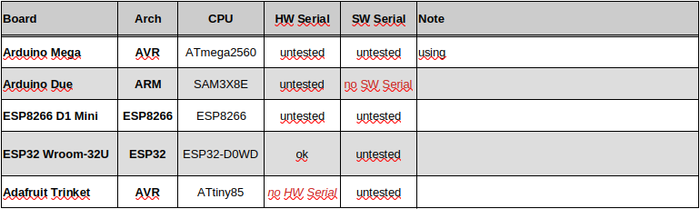

Portable LIN Slave Node Emulation
==================================

This Arduino library implements a Local Interconnect Slave node emulation. For an explanation of the LIN bus and protocol e.g. see https://en.wikipedia.org/wiki/Local_Interconnect_Network.

The class structure is very flexible and aims at supporting different Serial interfaces and architectures. It can easily be ported to other boards, if the respective interface supports BREAK detection - in which case a pull request is highly appreciated... 

**Supported functionality:**
  - multiple, simultaneous LIN nodes
  - automatic handling of frames via user-defined callback functions 
  - supports HardwareSerial and SoftwareSerial, if available and supports BREAK detection
  
**Supported Boards (with additional LIN hardware):**
  - AVR boards, e.g. [Arduino Uno](https://store.arduino.cc/products/arduino-uno-rev3), [Mega](https://store.arduino.cc/products/arduino-mega-2560-rev3) or [Nano](https://store.arduino.cc/products/arduino-nano)
  - ESP32 boards, e.g. [Espressif Wroom-32U](https://www.etechnophiles.com/esp32-dev-board-pinout-specifications-datasheet-and-schematic/) 
  
**Test Matrix:**

**Notes:**
  - the `handler()` method must be called faster than bytes are received (~0.5ms @ 19.2kBaud)
  - For AVR HardwareSerial install [NeoHWSerial](https://github.com/gicking/NeoHWSerial), which supports BREAK detection

Have fun!, Georg
