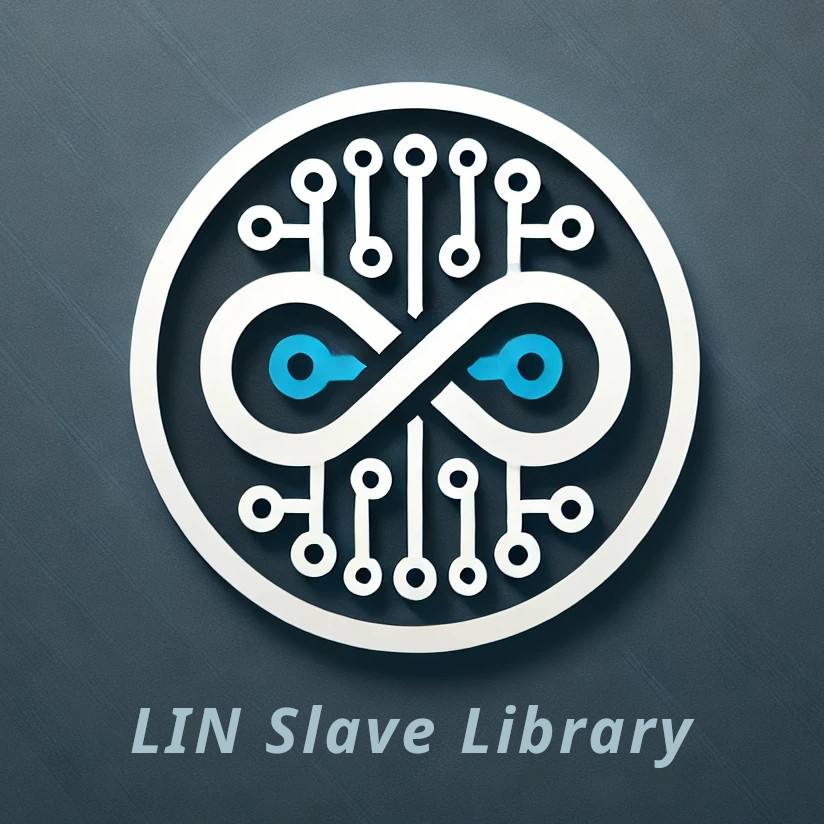

  

Portable LIN Slave Node Emulation
==================================

[Doxygen docs](https://gicking.github.io/LIN_slave_portable_Arduino/extras/documentation/html/index.html)

# Introduction

This Arduino library implements a Local Interconnect Network slave node emulation. For an explanation of the LIN bus and protocol e.g. see https://en.wikipedia.org/wiki/Local_Interconnect_Network.

Optionally LIN protocoll via RS485 is supported (see respective examples). In this case Rx-enable (=RE) must be statically enabled to receive LIN echo, and Tx-enable (=DE) is controlled by the Arduino. 

The class structure is very flexible and aims at supporting different Serial interfaces and architectures. It can easily be ported to other boards - in which case a pull request is highly appreciated... 

For a similar Arduino libary for LIN master emulation see https://github.com/gicking/LIN_master_portable_Arduino

## Supported functionality
  - background handling of frames via user-defined callback functions 
  - multiple, simultaneous LIN nodes
  - supports HardwareSerial and SoftwareSerial
  - supports LIN protocoll via RS485 with Tx direction switching
  
## Supported Boards (with additional LIN hardware)
  - Arduino AVR boards, e.g. [Uno](https://store.arduino.cc/products/arduino-uno-rev3), [Mega](https://store.arduino.cc/products/arduino-mega-2560-rev3) or [Nano](https://store.arduino.cc/products/arduino-nano)
  - Arduino AVR Cortex-M boards, e.g. [Due](https://store.arduino.cc/products/arduino-due)
  - Arduino Renesas Cortex-M boards, e.g. [Uno R4 Minima](https://docs.arduino.cc/hardware/uno-r4-minima/)
  - ATtiny boards, e.g. [Adafruit Trinket](https://www.adafruit.com/product/1501) (only SoftwareSerial)
  - ESP32 Classic boards, e.g. [Espressif Wroom-32U](https://www.etechnophiles.com/esp32-dev-board-pinout-specifications-datasheet-and-schematic/)
  - ESP32-S3 boards, e.g. [Arduino Nano-ESP32](https://docs.arduino.cc/hardware/nano-esp32/)
  - ESP32-C3 boards, e.g. [ESP32-C3 Super Mini](https://www.sudo.is/docs/esphome/boards/esp32c3supermini/)
  - ESP8266 boards, e.g. [Wemos D1 mini](https://www.wemos.cc/en/latest/d1/d1_mini.html)
  - STM32 boards, e.g. [Nucleo-STM32L432KC](https://www.st.com/en/evaluation-tools/nucleo-l432kc.html)

## Notes

  - The `handler()` method must be called at least every 500us. Optionally it can be called from within [serialEvent()](https://reference.arduino.cc/reference/de/language/functions/communication/serial/serialevent/)

  - For ESP32 and ESP8266, library `EspSoftwareSerial` must be installed, even if `SoftwareSerial` is not used in project 

  - LIN frame synchronization is via the `BREAK` signal, which corresponds to a long dominant pulse. On the receiver side this corresponds to `0x00` with missing stop bit (aka framing error, `FE`). Unfortunately, the Arduino behavior on a `FE` event is not specified, and different implementations treat it differently. Therefore, this library has to handle frame synchronization differently, depending on `Serial` type. Specifically:

    - ESP32 `HardwareSerial` and AVR `NeoHWSerial`:
      - `BREAK` is received, `FE` flag **is** available
      - sync on `Rx==0x00` (= `BREAK`) with `FE==true` 
      - assert that `BREAK` is followed by `SYNC==0x55`
      - this is according to LIN standard and most robust

    - AVR, SAMD, ESP8266 and STM32 `HardwareSerial`. AVR  and Renesas `SoftwareSerial`:
      - `BREAK` is received, `FE` flag **not** available
      - sync on `Rx==0x00` (= `BREAK`) after minimal inter-frame pause
      - assert that `BREAK` is followed by `SYNC==0x55`
      - this is **not** according to LIN standard and less robust

    - Renesas `HardwareSerial`. ESP32 & ESP8266 `SoftwareSerial`: 
      - `BREAK` **dropped** due to missing stop bit, `FE` flag **not** available
      - sync on `Rx==0x55` (= `SYNC`) after minimal inter-frame pause
      - this is **not** according to LIN standard and least robust

    - STM32 `SoftwareSerial`: 
      - `BREAK` is received, but sometimes `Rx!=0x00`, `FE` flag **not** available
      flag **not** available
      - ignore `BREAK` due to unreliable value
      - sync on `Rx==0x55` (= `SYNC`) after minimal inter-frame pause
      - this is **not** according to LIN standard and least robust
  
  - As stated above, default `BREAK` detection on 8-bit AVR boards is via [`NeoHWSerial`](https://github.com/gicking/NeoHWSerial) library, which can detect `FE`. Notes

    - `Serial` and `NeoHWSerial` instances are incompatible and must not be used within the same sketch. If possible use only `NeoHWSerial` for most robust frame synchronization
    
    - If that is not possible, comment out `USE_NEOSERIAL` in file `LIN_slave_NeoHWSerial_AVR.h` to use standard `HardwareSerial` with less robust synchronization

  - SoftwareSerial sending is blocking on all platforms, i.e. "background operation" only applies to receiving master commands

# Test Matrix

An *ok* in the below test matrix indicates that normal master request frames are received, slave responses are sent and bus disconnection is detected (-> error). Also, code execution starts with only external supple, i.e. USB not connected. No extensive testing of *all* possible error cases was performed. Please let me know if you experience unexpected errors.

Logic analyzer screenshots of LIN bus, idle pin and error pin levels are stored in folder "./extras/testing/*Board*"

Have fun!, Georg

----------------

Revision History
----------------

**v1.5 (2026-08-02)**
  - account for breaking change in STM32 Core v3.0.0 (see https://github.com/stm32duino/Arduino_Core_STM32/releases/tag/3.0.0)

**v1.4 (2026-05-19)**
  - add support for ESP32-C3 Super Mini board

**v1.3 (2025-02-06)**
  - add support for ESP32-S3, Nano Every, STM32, and Uno R4 Minima (no HWSerial, see [issue](https://github.com/arduino/ArduinoCore-renesas/issues/524))
  - consolidate examples for different boards and LIN/RS485 interfaces
  - remove `Ticker` examples, due to standard 1ms min. period too long

**v1.2 (2025-10-28)**
  - add dependency on `EspSoftwareSerial` in `library.properties`
  - add notes for `EspSoftwareSerial` dependency
  - in ESP32 Ticker example use standard `Ticker.attach()` instead of Espressif specific `Ticker.attach_us()`. Note: ESP8266 has 1ms minimum
  - add to integration tests: ESP32 Nano (Arduino ESP32 core) and Wemos Lolin32 Lite (Espressif ESP32 core)
  - fixed ESP32 issue if Serial0 undefined, see https://github.com/gicking/LIN_slave_portable_Arduino/issues/3

**v1.1 (2025-05-03)**
  - harmonize with [LIN master portable](https://github.com/gicking/LIN_master_portable_Arduino)
  - simplified debug output via macro
  - renamed `SERIAL_DEBUG` to `SERIAL_CONSOLE` to avoid mixup with (internal) debug output
  - add ESP32 Ticker example to support blocking user functions in `loop()`
  - full regresstion tests and add some comments
  - update reference

**v1.0 (2025-02-01)**
  - initial release

