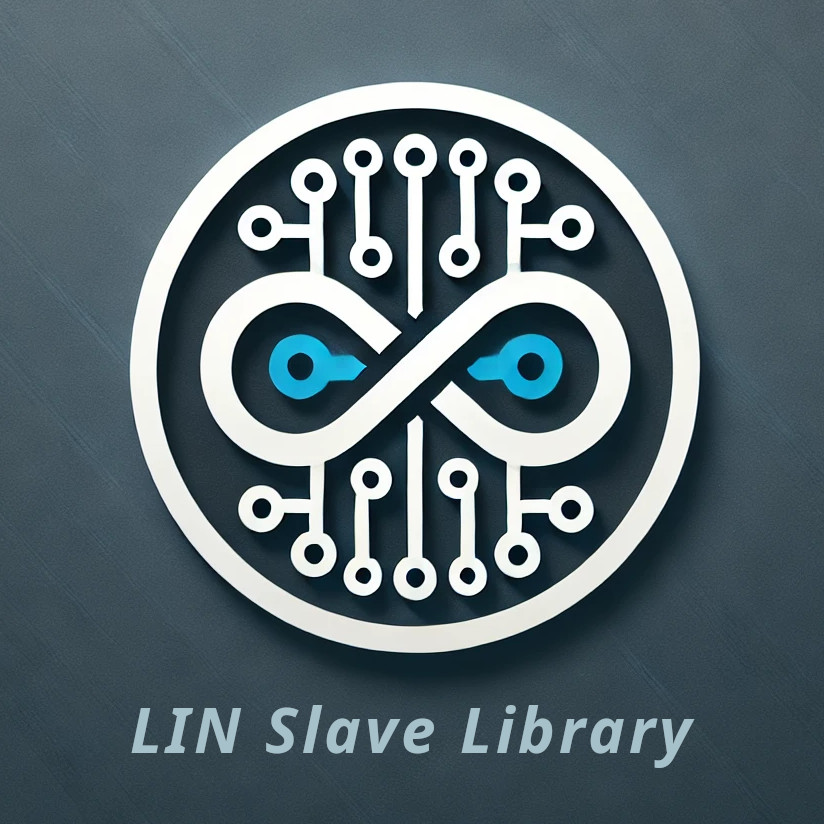

  

Portable LIN Slave Node Emulation
==================================

[Doxygen docs](https://gicking.github.io/LIN_slave_portable_Arduino/extras/documentation/html/index.html)

# Introduction

This Arduino library implements a Local Interconnect Network slave node emulation. For an explanation of the LIN bus and protocol e.g. see https://en.wikipedia.org/wiki/Local_Interconnect_Network.

The class structure is very flexible and aims at supporting different Serial interfaces and architectures. It can easily be ported to other boards - in which case a pull request is highly appreciated... 

For a similar Arduino libary for LIN master emulation see https://github.com/gicking/LIN_master_portable_Arduino

## Supported functionality
  - multiple, simultaneous LIN nodes
  - background handling of frames via user-defined callback functions 
  - supports HardwareSerial and SoftwareSerial, if available
  - supports LIN protocoll via RS485
  
## Supported Boards (with additional LIN hardware)
  - AVR boards, e.g. [Arduino Uno](https://store.arduino.cc/products/arduino-uno-rev3), [Mega](https://store.arduino.cc/products/arduino-mega-2560-rev3) or [Nano](https://store.arduino.cc/products/arduino-nano)
  - ATtiny boards, e.g. [Adafruit Trinket](https://www.adafruit.com/product/1501) (only SoftwareSerial)
  - SAM boards, e.g. [Arduino Due](https://store.arduino.cc/products/arduino-due)
  - ESP32 boards, e.g. [Espressif Wroom-32U](https://www.etechnophiles.com/esp32-dev-board-pinout-specifications-datasheet-and-schematic/) (only HardwareSerial)
  - ESP8266 boards, [Wemos D1 mini](https://www.wemos.cc/en/latest/d1/d1_mini.html) (only HardwareSerial)

## Notes
  - the `handler()` method must be called faster than bytes are received (~0.5ms @ 19.2kBaud). Optionally it can be called from within [serialEvent()](https://reference.arduino.cc/reference/de/language/functions/communication/serial/serialevent/)
  - In general, framing errors are **not** returned by Arduino `Serial` implementations. In these cases, frame synchronization is via a configurable inter-frame pause. Exceptions are 
    - AVR via [NeoHWSerial](https://github.com/gicking/NeoHWSerial) library, which supports custom UART ISRs. 
    - ESP32, which natively supports a `onReceiveError()` method
  - for AVR `Serial` and `NeoHWSerial` instances are incompatible and must not be used within the same sketch. If possible use only `NeoHWSerial`, else you have to disable `LIN_slave_NeoHWSerial_AVR.h` and enable `LIN_slave_HardwareSerial.h` via macros
  - ESP8266 and ESP32 [SoftwareSerial](https://github.com/plerup/espsoftwareserial) drops BREAK (=0x00 without stop bit) altogether. Therefore these platforms only support HardwareSerial
  

# Test Matrix

Have fun!, Georg

----------------

Revision History
----------------

**v1.0 (pending)**
  - initial release

